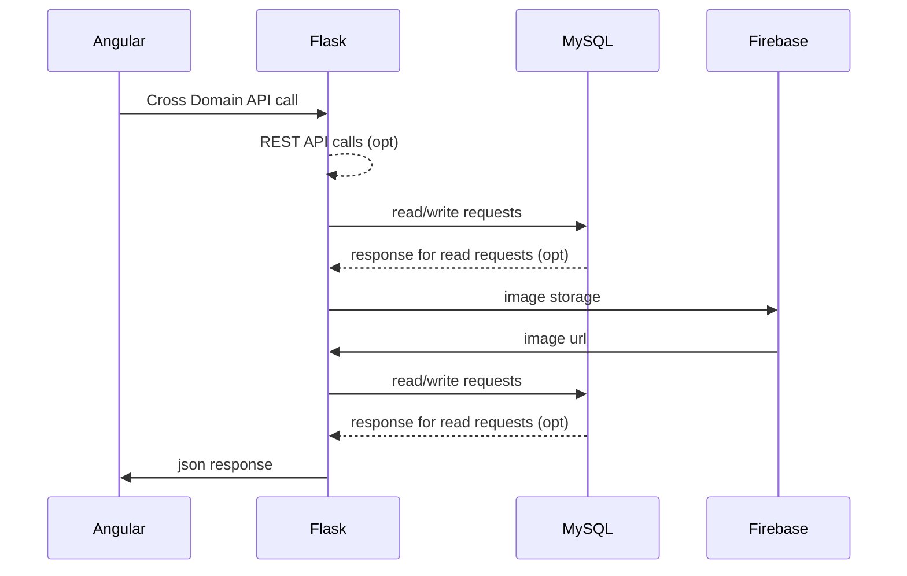

# ScriptoriumV2

ScriptoriumV2, an upgraded version of the [Scriptorium](https://github.com/AryaRajivChaloli/Scriptorium), is an **online library information system** which allows easy access to books belonging to various genres. It also has a smart recommendation system in place, which suggests books to users based on their borrowing history. 

It has an **Angular CLI** frontend, **Flask** backend, and the storage is handled using **MySQL** (InnoDB) and **Firebase**.

Largely, the functionalities implemented include the following.
1. Without <b>logging in</b>to the website, a user can still <b>view and search all books</b> that are available
2. Once a user logs in, they can <b>borrow upto three books</b> at a time, for a period of 21 days. There is a provision for them to renew or return the book before this period expires, beyond which they will be charged a nominal fee.
3. Only a logged-in user can avail the <b>personalised book recommendations </b>feature, else, the latest books added to the library are recommended.
4. Anyone, irrespective of whether they are a member, can <b>contribute books</b> to the library


## Application Flow
A schematic diagram portraying the flow of data across the system. If the Diagram is not rendered and looks like plain text/code, then please enable the [Github + Mermaid](https://chrome.google.com/webstore/detail/github-%2B-mermaid/goiiopgdnkogdbjmncgedmgpoajilohe) extension for Chrome.



## Prerequisites
Make sure you have installed all of the following prerequisites on your development machine:
* Python3 - [Download & Install Python3](https://python.org), and ensure that it is latest version to avoid any version clashes.
* Node.js - [Download & Install Node.js](https://nodejs.org/en/download/) and the npm package manager. If you encounter any problems, you can also use this [GitHub Gist](https://gist.github.com/isaacs/579814) to install Node.js.
* MySQL Server - [Download & Install XAMPP](https://www.apachefriends.org/index.html), and make sure it's running on the default port.
* Angular CLI - Use the [Angular CLI](https://angular.io/) to manage your front-end packages. Make sure you've installed Node.js and npm first, then install Angular globally using npm.

## Deploy the Application

Follow these steps systematically to deploy this application on your system:

1. Clone the repository to your local system
```bash
$ git clone https://github.com/AryaRajivChaloli/ScriptoriumV2.git
```
2. Navigate into the folder and create a local python environment
```bash
$ cd ScriptoriumV2
$ pipenv shell
```
3. Install the dependencies in the environment
```bash
$ pip install flask flask-cors flask-mysqldb pyrebase4
```

4. Create a firebase storage and update the firebase configuration in the `app.py` file using your credentials. Following which, add the private key to the firebase project in the `keyfile.json` file.

5. Start the MySQL server. Create a database with 4 tables: users, books, borrow, and history with the requisite fields in each one of them.

6. Run the flask server (on port 5000 by default)
```bash
$ flask run
```
7. Run the angular server (on port 4200 by default), in the angular app folder
```bash
$ cd scriptorium
$ ng serve
```

## Run the Application
Once all the steps required to deploy the application has been completed, it is now ready to go!

View the application on the browser at port 4200


## Overview
The following is a glimpse of the Recommendation page in the Application.


---
